# bamazon #
An Amazon-like storefront using Node.js and MySQL, requiring MySQL and Inquirer npm packages 

created by Jennifer Gaumnitz
- - - -
bamazon demo video: https://drive.google.com/open?id=1Bn-3lUqKm_eHv1VR-tGG0HeuPeBnpsoh

GitHub repository: https://github.com/JLGaumnitz/bamazon

- - - -
### How You Can Get Started With This Project ###

For this command line node app, you will need to have installed:

* Node
* Rquired npm packages: inquirer and mysql
* MySQL Database Server
* Software to interact with database such as MySQL Workbench or Sequel Pro for Mac

To install and use this application yourself, clone the git folder to your hard drive. Then create a MySQL database named "bamazon_db". You can use the schema.sql file provided to create the database and add the 'products' table to your database. Before running any of the node files, you will need to run "npm install."

### The two views: Customer and Manager ###

### _Customer View_ ###

* To run the customer view, type "node bamazonCustomer.js" in the command line.

Executing this file displays all of the items available for sale, and includes the IDs, names, prices, and quantity available for all the products for sale.

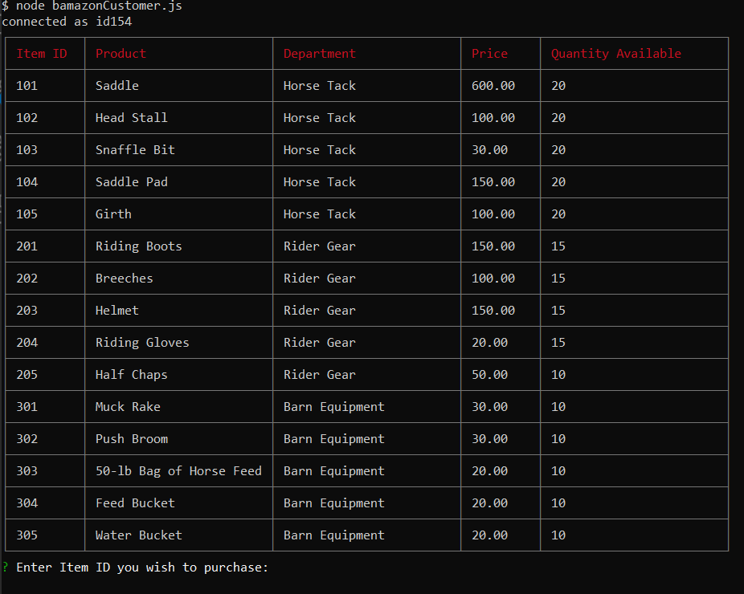

The app then prompts the user with two messages.

   * The first asks them to input the ID of the product they would like to buy.
   * The second asks how many units of the product they would like to buy.

   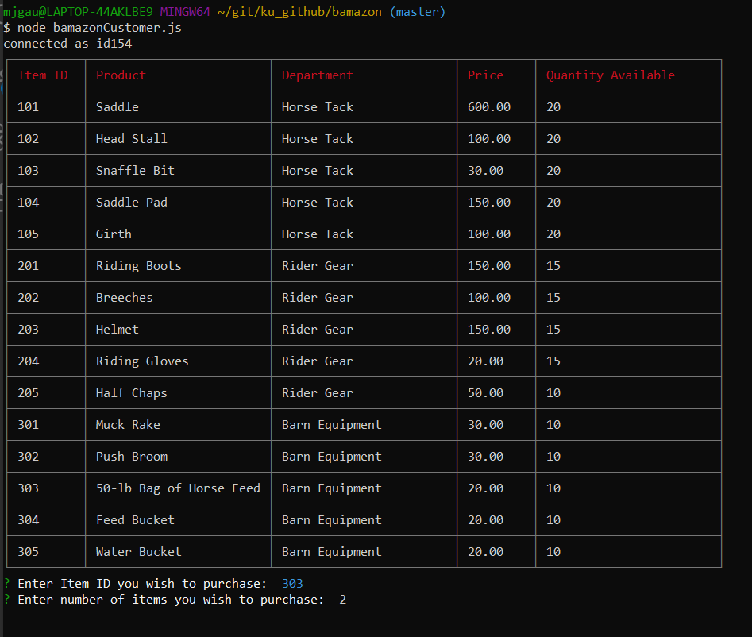

Once the customer has placed the order, the application checks the database to see if the store has enough of the product to meet the customer's request.

If there is sufficient product, the app fulfills the customer's order.
   * The app displays a message that the purchase was successful and calculates and displays the total cost of the purchase.
   * The app updates the SQL database to decrement the amount of product purchased to reflect the remaining quantity.
   
   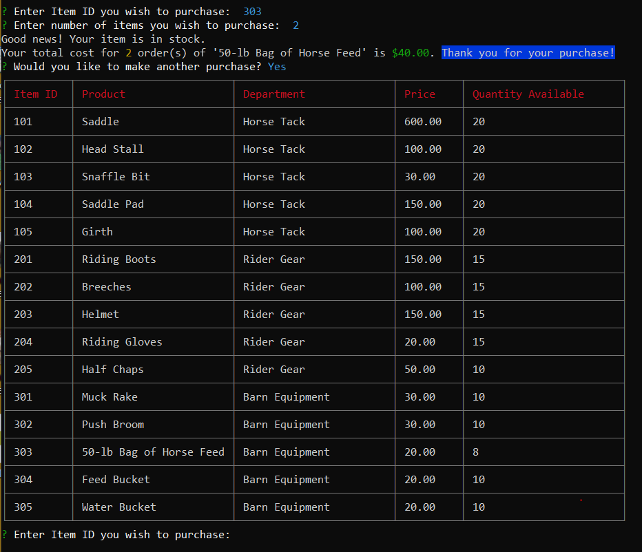

If there is insufficient inventory, the app alerts the customer and asks the customer to make a different selection or reduce the quantity requested. The order does not go through.

 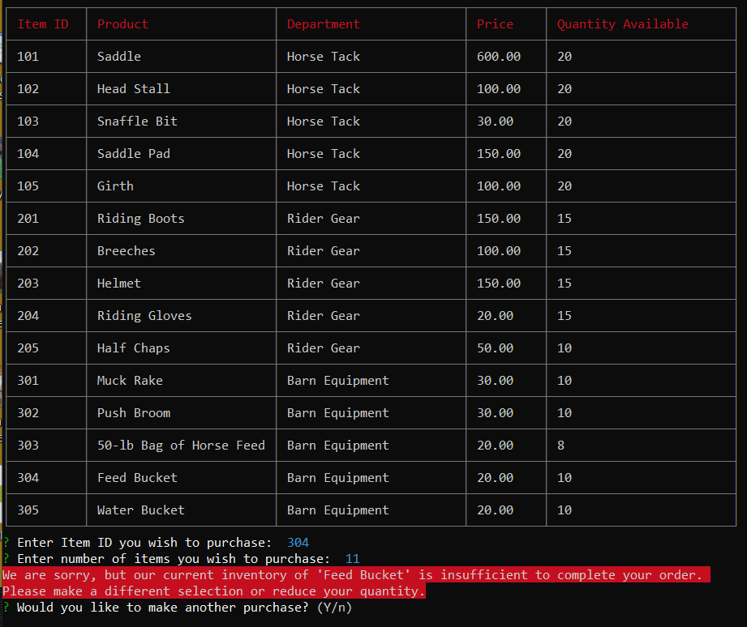

Once the customer has finished making purchases, they will answer "No" to the question "Would you like to make another purchase?" to exit the application.

## _Manager View_ ##

* To run the manager view, type "node bamazonManager.js" in the command line.

Executing this file displays a list of prompts, each with a different task the manager can choose by using the arrow keys and pressing enter. After executing each task, the manager is asked if they would like to complete another task.

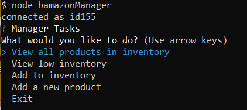

**View all products in inventory** will yield a table like the following:

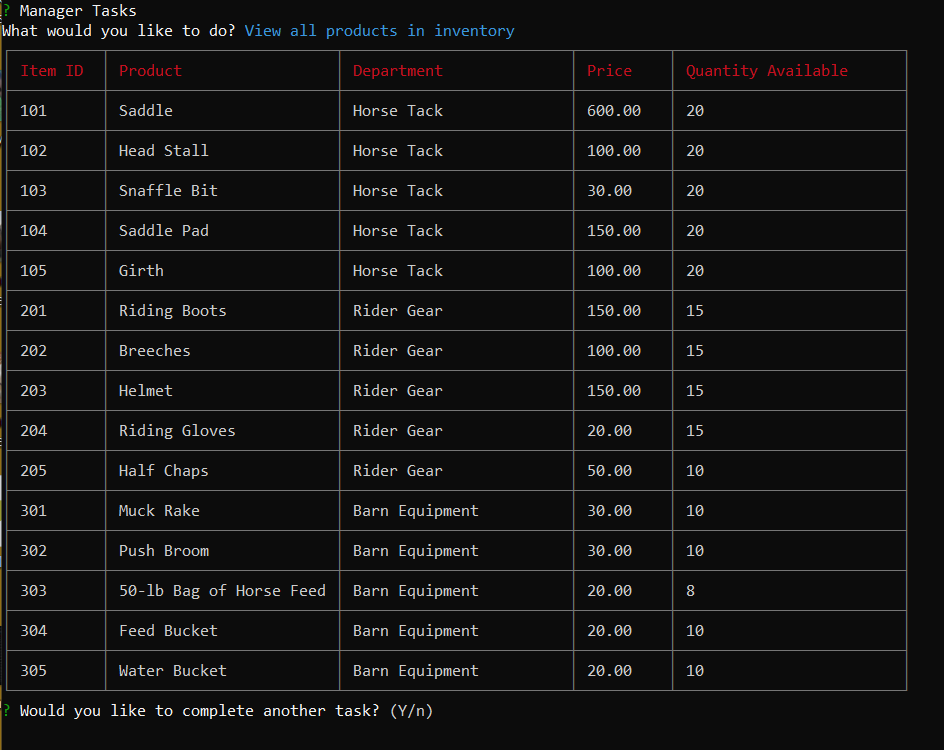

**View low inventory** yields a table of just the products with fewer than 5 items remaining in inventory:

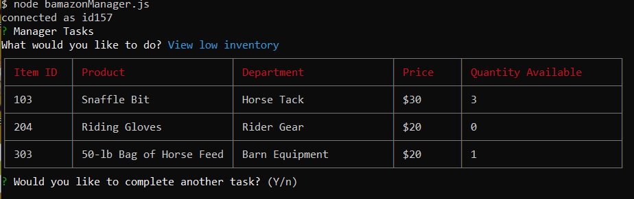

**Add to inventory** allows the manager to choose an existing product from a list (using the arrow keys and Enter) and enter a quantity to increase the stock for that item.

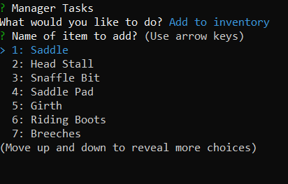

When successful, the manager will see a message stating the new stock quantity.

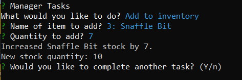

**Add a new product** allows the manager to add a new product to the store's inventory. The task begins by asking for the product name and asking the manager to choose the department from a prepopulated list (using the arrow keys and Enter).

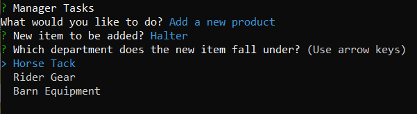

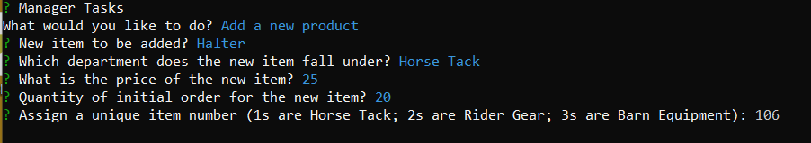

Upon successfully adding the item, the manager sees a message that states that the order for the new product was successfully placed:

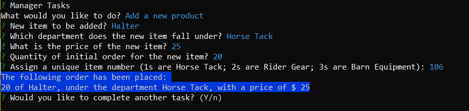

And the database for the store's inventory is updated with the new item's ID number, name, price, and quantity available.

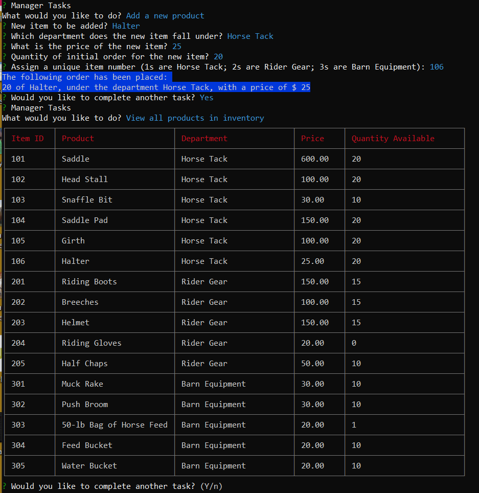

### Why the Project is Useful ###

  The app fulfills a homework assignment for University of Kansas Coding Boot Camp, August 2019 to February 2020. Besides allowing me to continue working with Node.js and npm packages, the assignment also taught me to work with MySQL and the MySQL Workbench

### Where Users Can Get Help with This Project ###

  Questions? Contact Jennifer Gaumnitz at jlgaumnitz@gmail.com

### Who Maintains and Contributes to the Project ###

  Jennifer Gaumnitz created the project. I probably will not update it again after completing this assignment. 

